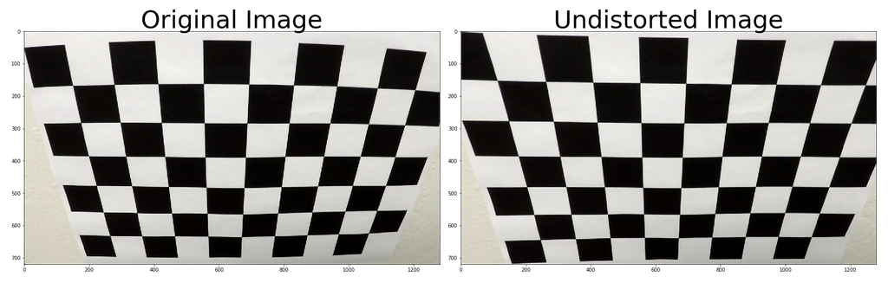
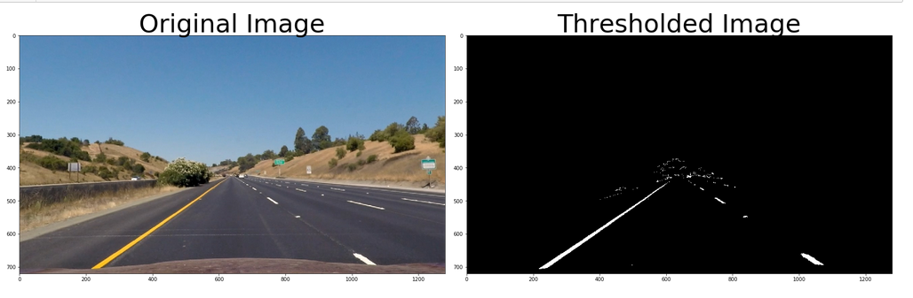
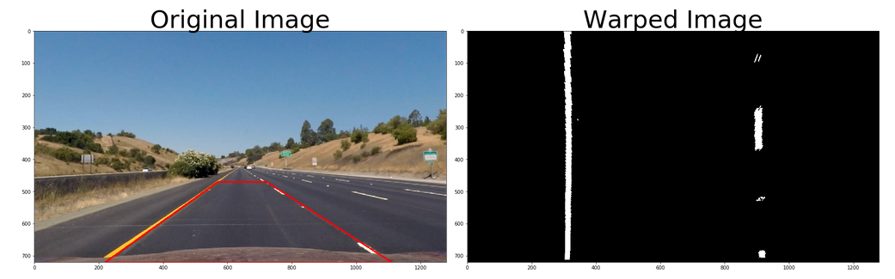
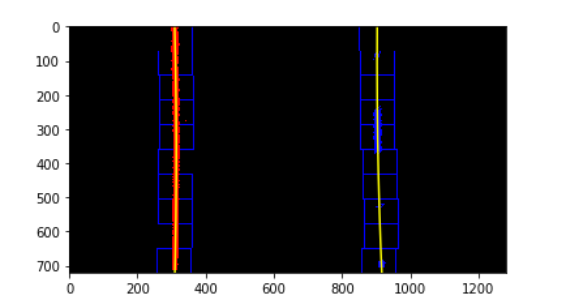
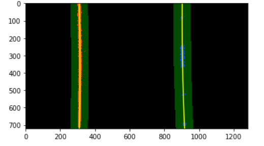
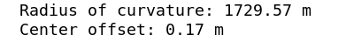

### History
V1.0(2019/03/12)
-first release 

V1.01(2019/03/14)
-fine tune the scale factor

### Advanced Lane Finding Project
The goals / steps of this project are the following:
- Compute the camera calibration matrix and distortion coefficients given a set of chessboard images.
- Apply a distortion correction to raw images.
- Use color transforms, gradients, etc., to create a thresholded binary image.
- Apply a perspective transform to rectify binary image ("birds-eye view").
- Detect lane pixels and fit to find the lane boundary.
- Determine the curvature of the lane and vehicle position with respect to center.
- Warp the detected lane boundaries back onto the original image.
- Output visual display of the lane boundaries and numerical estimation of lane curvature and vehicle position. 
  
### Description
Jupyter notebook Advanced Lane Finding_V1.01.ipynb contains the code to illustrate the result of each step of the lane lines detecting pipeline.  The test images are placed in test_images directory. Input videos are project_video.mp4, challenge_video.mp4, and harder_challenge_video.mp4 . Output images, illustrating how pipeline works, and the result video with the detected lane boundaries are placed in output_images and output_videos correspondingly.
    
### Camera Calibration
The code for this step is can be found in Advanced Lane Finding_V1.01.ipynb by searching the keyword “Caliberating the camera”.

I start by preparing "object points", which will be the (x, y, z) coordinates of the chessboard corners in the world. Here I am assuming the chessboard is fixed on the (x, y) plane at z=0, such that the object points are the same for each calibration image. Thus, “objp” is just a replicated array of coordinates, and objpoints will be appended with a copy of it every time I successfully detect all chessboard corners in a test image. “imgpoints” will be appended with the (x, y) pixel position of each of the corners in the image plane with each successful chessboard detection.

Then used the output “objpoints” and “imgpoints” to compute the camera calibration and distortion coefficients using the cv2.calibrateCamera() function. An example of undistorted image generated using camera calbration results is shown below.

### Pipeline (Images)
I used a combination of color and gradient thresholds to generate a binary image, you can search the keyword “Gradients and color transforms” in  Advanced Lane Finding_V1.01.ipynb

I have also used region of interest technique to get rid of trees, mountains, etc. An example of undistorted image generated using camera calbration results is shown below.

### Perspective Transform
You can search the keyword “Perspective Transform” in  Advanced Lane Finding_V1.01.ipynb.

I have choose source[(570, 470), (722,470),(1110,720),(220,720)] and destination[(320,1),(920,1),(920,720),(320,720)]. Here is an output example:

### Identified lane-line pixels and fit their positions with a polynomial
You can search the keyword “Sliding Window Search”  in  Advanced Lane Finding_V1.01.ipynb.

Here is an output example:

For filling with polynomial, you can search the keyword “Filling with polynomial”  in  Advanced Lane Finding_V1.0.1.ipynb.

Here is an output example:

### Computing the radius of curvature and center offset
You can search the keyword “Computing the radius of curvature and center offset”  in  Advanced Lane Finding_V1.01.ipynb.

The radius of curvature is computed according to the formula and method described in the classroom material. Since we perform the polynomial fit in pixels and whereas the curvature has to be calculated in real world meters, we have to use a pixel to meter transformation and recompute the fit again.

The mean of the lane pixels closest to the car gives us the center of the lane. The center of the image gives us the position of the car. The difference between the 2 is the offset from the center.
The test results of image are as follow:

